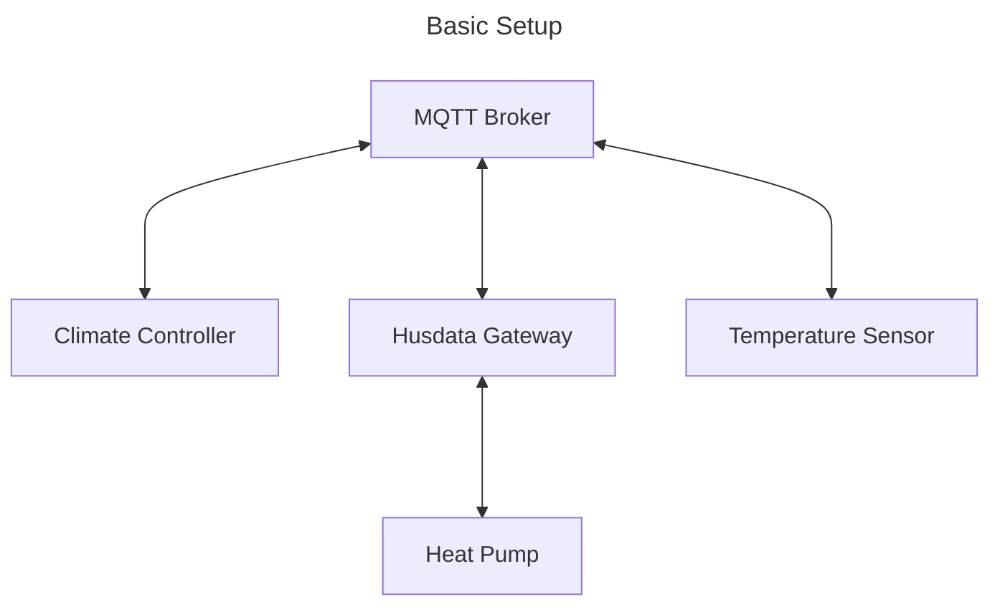

# Climate Control
This repository supports controlling and monitoring the internal climate of a household utilizing [custom climate sensors](./measurement_device/README.md) based on Raspberry Pi Pico W and a Heat-pump Controller from husdata.se

Below is a schematic of the different components.  




This repo contains several sub-packages.
- husdata
- controller

> **husdata**  
> This package includes everything to control and read data from the H60 husdata box and also a structure for handling different heat pump controllers like the Rego1000.  

> **controller**  
> This package uses the other packages and also includes the main entry point for starting all. It also implements specific setup for the H60 together with Rego1000 controller.  
> Also handles and runs the different control strategies. 

## Development
Installation of controller packages is done by installing via `uv` from astral.
```sh
uv sync --extra dev
```
starting the controller by and dashboard using command
```sh
uv run ./src/controller/main.py
```
The main script most likely needs to be modified for your specific setup.

### Using Docker
If you are using `docker` and `docker-compose` you can install and deploy everything with a single command.  
When `cd` into your cloned repository: 
```bash
docker compose up -d
```
This will download everything, build the docker image and deploy it.
More information on docker [here](https://www.docker.com/).

### Raspberry Pi
When installing and running on raspberry pi, you have to change the boot config to wait for network connection before proceeding with boot. Otherwise the script will fail. This can be done in `sudo raspi-config`

