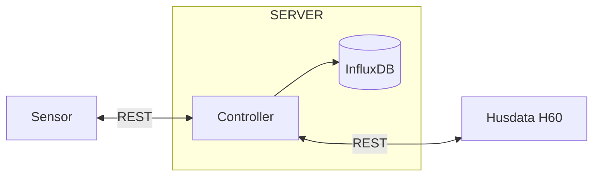
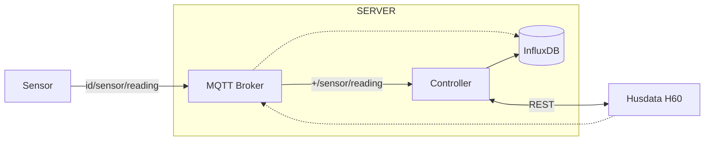
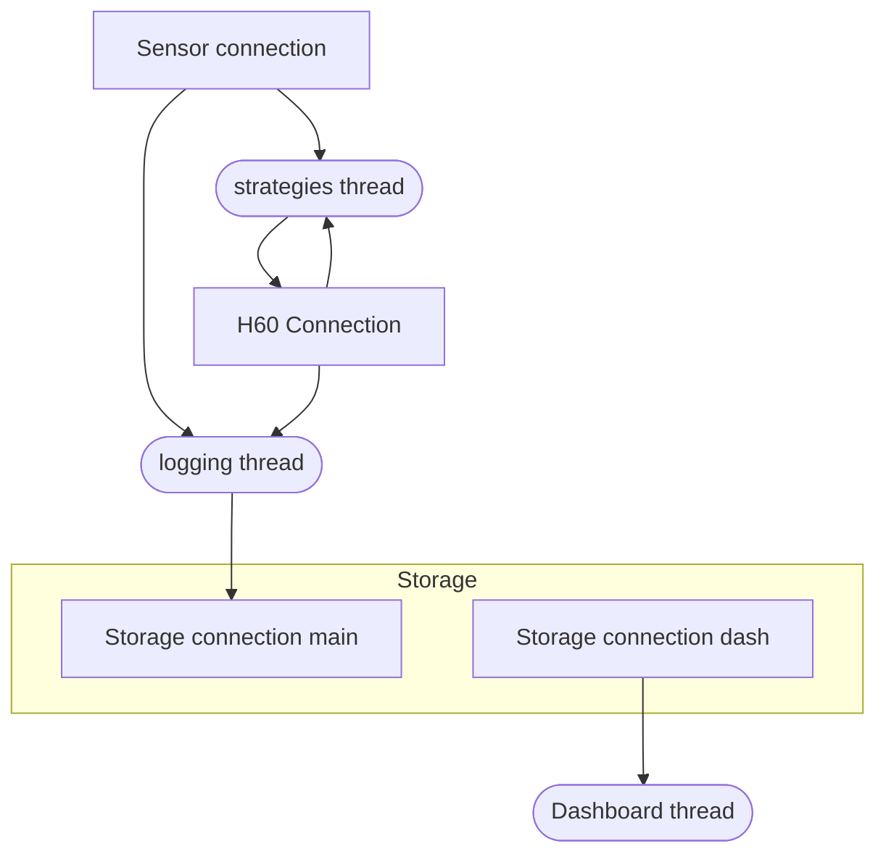
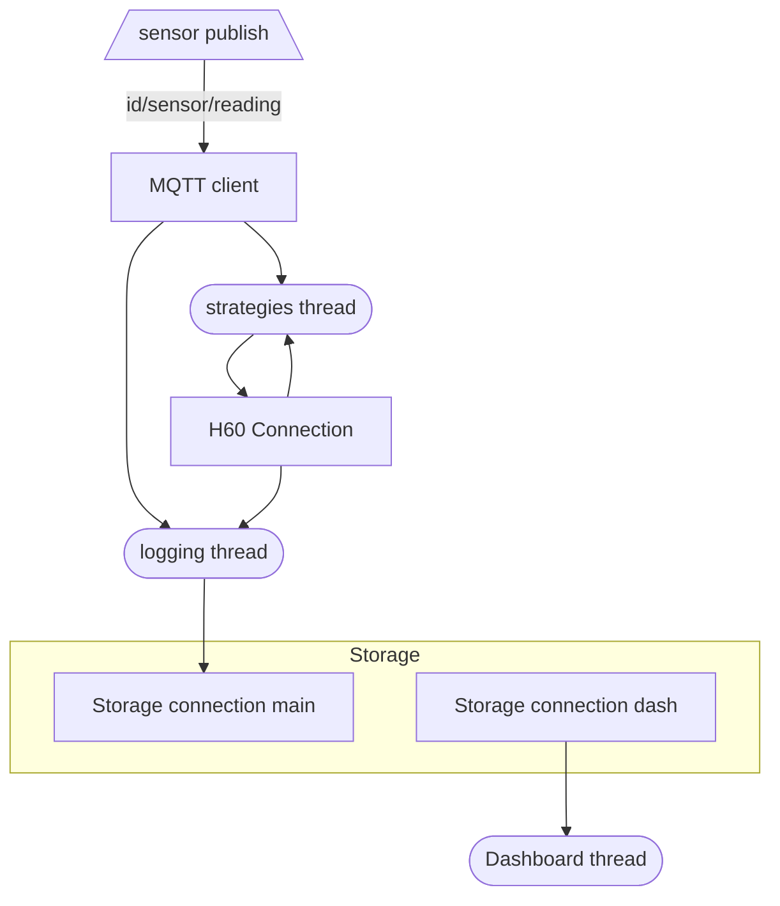
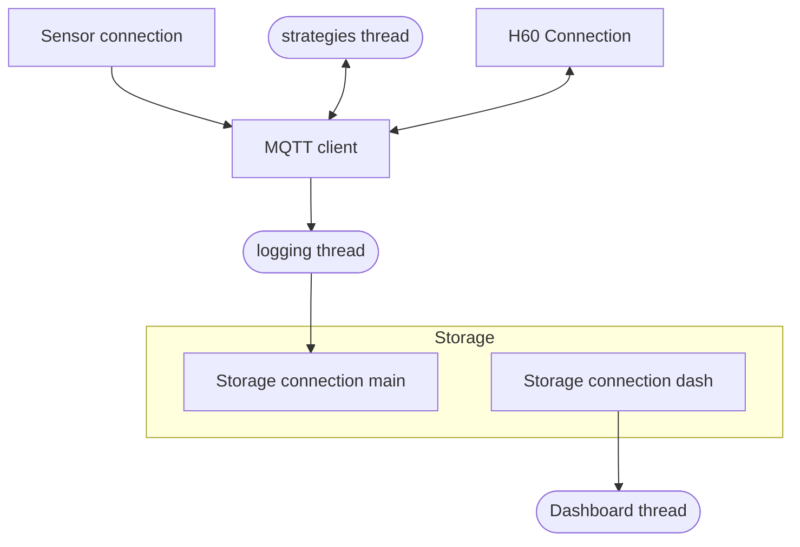

# Implementation plan of mqtt

## Overview
Dashed lines are not implemented but are potential way of doing comunicattion. 

## Controller (present)
Issues with present solution

- Double storage connections due to two diffrent packages. But this could be assigned through function arguments?

## First step
Remove direct connection with Sensors

## Second step
Remove `Strategies` and 

