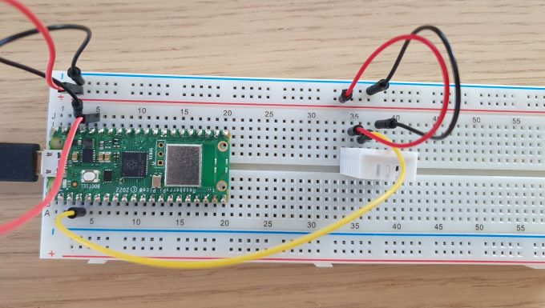

# Pico W sensor and webserver

## Assembly
The wiring is quite simple. We only need the DHT22 sensor and the data pin connecting to pin 4 (GP2) 

## Installation

Follow the instructions on the [micropython website](https://micropython.org/download/rp2-pico-w/) to flash the raspberry pi pico W with the latest firmware. 

Using [thonny IDE](https://thonny.org/) you can copy the python files to the board. Files to be copied is:  
- config.py
- devices.py
- weberver.py
- wifi.py

Also a file `config.json` needs to be created on the board including the following information: 
```json
{
    "SSID": "YOUR_WIFI_SSID",
    "password": "YOUR_WIFI_PASSWORD",
    "sample_rate": 10,  # time in seconds between mqtt publish"
    "dht_data_pin": 2,  # Pin where data is connected
}
```

Then when booted you should be able to access and read from the sensor via `http://{IP_ADDRESS_OF_PICO}/read/` and it should respond with json formatted text. 
